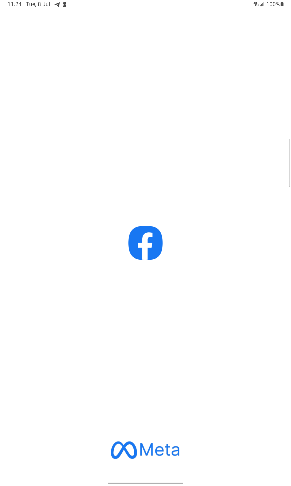
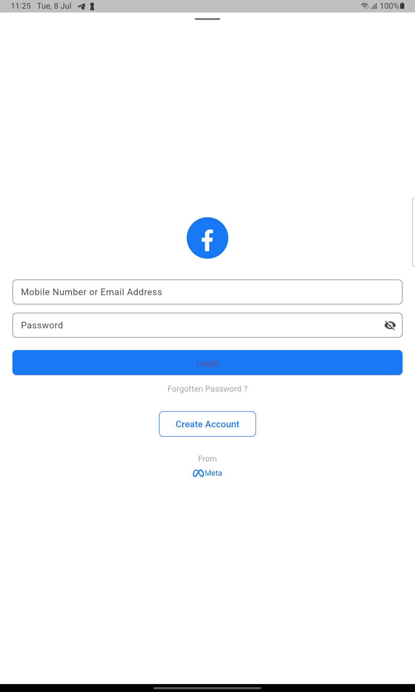
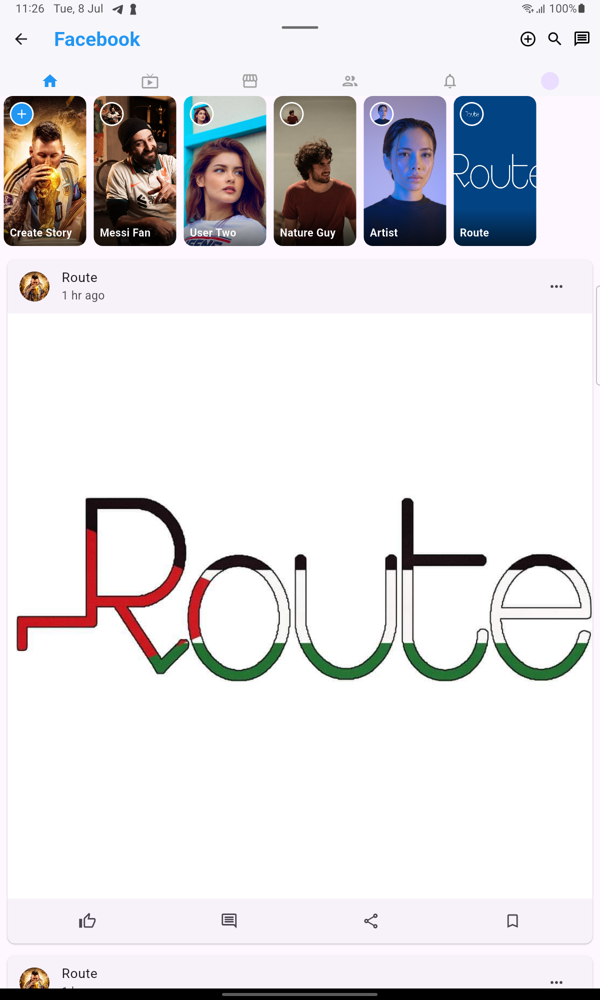

# 📱 Facebook UI Clone in Flutter

A full-featured Flutter app that replicates the core UI experience of Facebook’s mobile app. This project is designed to showcase modern UI techniques, stateful/stateless architecture, and component modularization using Flutter.

---

## 🎯 Objectives
- Learn and apply Flutter widget composition
- Replicate a real-world app interface (Facebook)
- Practice layout structuring, image assets usage, and responsive design
- Modularize code for reusability and scalability

---

## 📸 Screenshots

### 🔵 Splash Screen
Displays the centered Facebook logo with branding at the bottom (“From Meta”).



### 🔐 Login Screen
Allows users to enter credentials with UI elements for email, password, forgotten password link, and a CTA for creating a new account.



### 🏠 Home Screen
Includes a scrollable post feed, stories section, AppBar with Facebook-style actions, and styled story cards with overlays.



## ✨ Features

### ✅ UI Components
- Facebook-style **AppBar** with title and action icons (add, search, chat)
- Fully scrollable **stories section** with dynamic images and labels
- Scrollable **post feed** using `ListView.builder`
- Like, comment, share, and bookmark icons
- `+` button on "Create Story" with overlay position

### 🎨 Design Highlights
- Matching Facebook color palette (blue, white, gray tones)
- Circular avatars, rounded corners, and gradient overlays
- Fully responsive using device width

### 🧱 Architecture
- **Stateless** widgets where possible
- **Stateful** upgrade-ready (can add state interactions later)
- Code split into logical components: `StoriesWidget` and `PostWidget`

---

## 🧰 Tech Stack
- **Flutter SDK**: 3.8+
- **Dart** for programming
- Material Design components
- Asset-based splash screen with `flutter_native_splash`

---

## 🚀 Getting Started
To run this project locally:

1. Clone this repository:
```bash
git clone https://github.com/YOUR_USERNAME/facebook_ui_flutter.git
cd facebook_ui_flutter
```

2. Get dependencies:
```bash
flutter pub get
```

3. Run on emulator or device:
```bash
flutter run
```

> Make sure your assets are correctly declared in `pubspec.yaml`

---

## 📁 Folder Structure
```bash
lib/
├── main.dart                     # Entry point
│   ├── login_screen.dart         # Login form UI
│   └── home_screen.dart          # Main home screen with posts and stories
├── widgets/
│   ├── stories_widget.dart       # Stories carousel widget
│   └── post_widget.dart          # Post list widget
assets/
├── logo.png
├── meta_brand.png
├── model1.png, model2.png, etc.
├── route_post.png, route_prof.png
└── screenshots/
    ├── splash_screen.png
    ├── login_screen.png
    └── home_screen.png
```

---

## 🔄 Future Improvements
- Add real-time stories and post content
- Implement Firebase login/authentication
- Add animations and post reactions
- Dark mode theming
- Backend integration to fetch data

---

## 👨‍💻 Author
**Fager Hussein**  
Flutter Developer & UI Enthusiast

---
